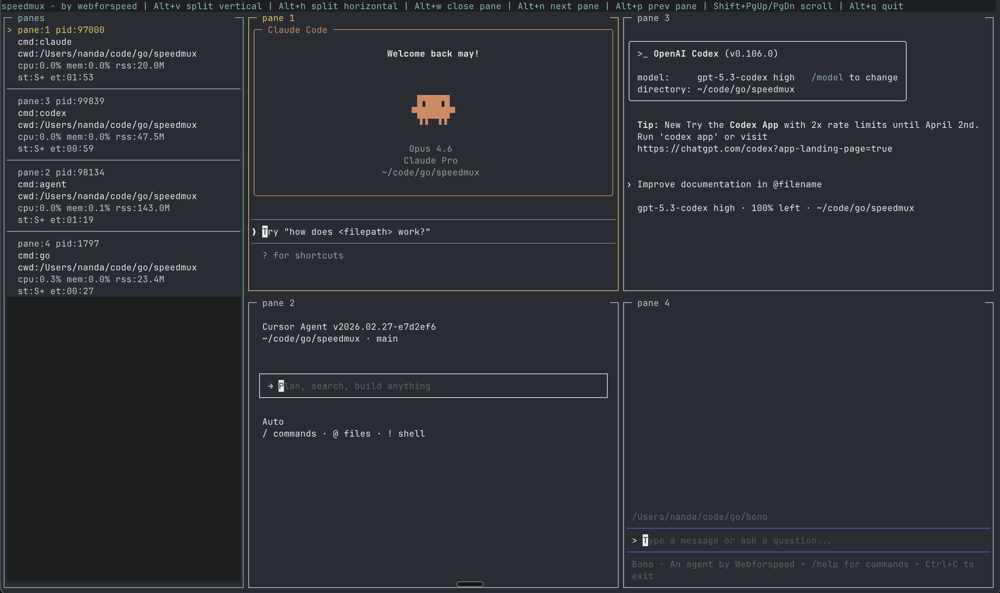

# speedmux - A Go Terminal Multiplexer

A simple terminal multiplexer written in Go and libghostty.

## Screenshot


## Features
- Multiple independent terminal sessions (one shell per pane)
- Split active pane vertically or horizontally
- Cycle focus between panes
- Optional `libghostty-vt` rendering backend (enabled by default)

## Install / Deploy
Build and install the binary into your local bin so every terminal can run it:

```bash
make deploy
```

By default this installs `speedmux` to `~/.local/bin/speedmux`.

If `~/.local/bin` is not already on your `PATH`, add this to your shell config (`~/.zshrc`, `~/.bashrc`, etc.):

```bash
export PATH="$HOME/.local/bin:$PATH"
```

## Run
```bash
go run .
```

## Keybindings
- `Alt+v`: split active pane vertically (left/right)
- `Alt+h`: split active pane horizontally (top/bottom)
- `Alt+w`: close active pane
- `Alt+n`: focus next pane
- `Alt+p`: focus previous pane
- `Shift+PgUp` / `Shift+PgDn`: scroll active pane up/down
- `Shift+Home` / `Shift+End`: jump scroll to top/bottom
- `Alt+q`: quit
- Mouse wheel over a pane: scroll that pane

## Notes
- The app starts with a single pane.
- Each new pane launches your `$SHELL` (falls back to `/bin/sh`).
- `MULTIPLEXER_GHOSTTY_VT=0 go run .` disables the ghostty-vt backend and uses the basic line renderer.
- `STATS=ON go run .` enables a debug stats row under the help bar (FPS, panes/splits, events, output line counts, and render cell totals).
